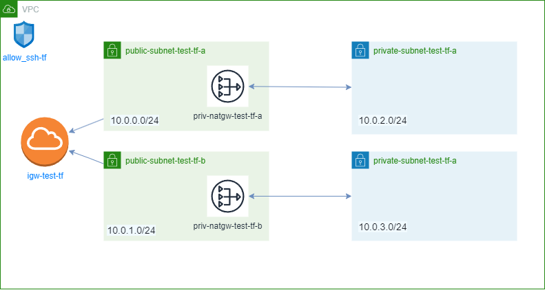

# terraform-aws-vpc
Terraform files to create a VPC in AWS.



## Setup

Create a file named terraform.tfvars and add your AWS Secret ID and key based on the example below:

```markdown
AWS_ACCESS_KEY = ""
AWS_SECRET_KEY = ""
AWS_REGION     = ""
```

Run terraform init, terraform plan and terraform apply.

## Uninstalling

Run terraform destroy.